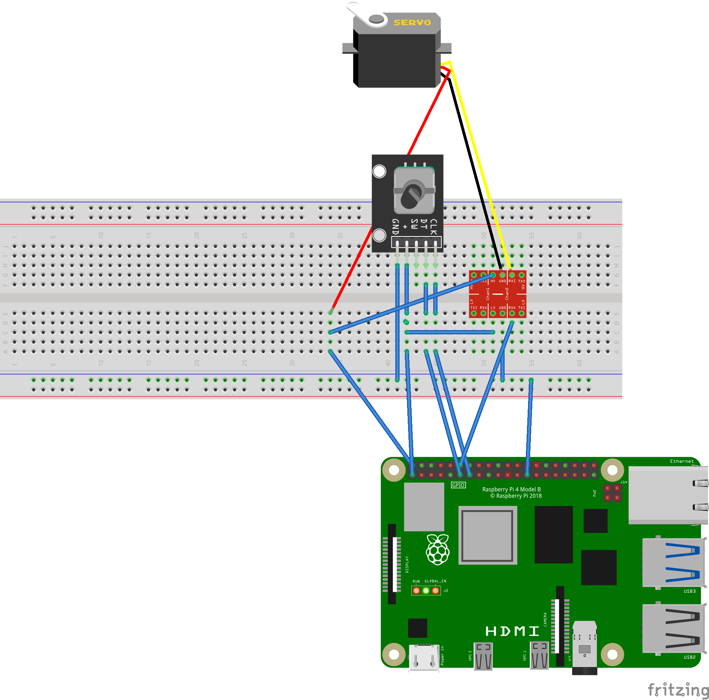
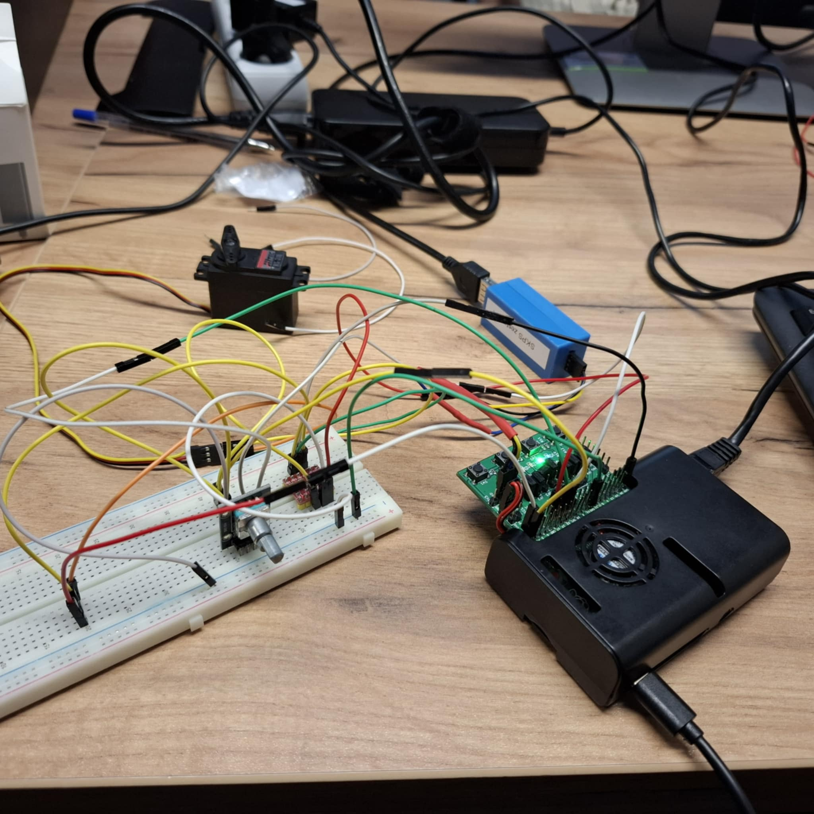
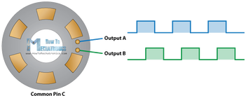
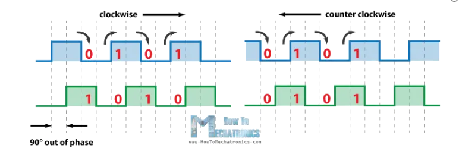

# Servo Control Using Rotary Encoder on OpenWRT Platform

## Introduction
The goal of this project is to develop a servo control system using a rotary encoder on an embedded device running OpenWRT. The project combines precise hardware PWM control with encoder signal reading via GPIO, enabling smooth and reliable servo position control. The implementation is written in C and packaged as an OpenWRT package for easy installation and integration.

---

## Electrical Connection Diagram
The wiring diagram has been modified as follows compared to the diagram below:
- **Pin change**: GPIO17 and GPIO27 have been replaced with GPIO23 and GPIO24
- **Additional connection**: Ground (GND) has been connected between the board and the converter

### Diagram before modifications:



### Connected diagram:


---

## OpenWRT Package with C/C++ Program

### Package Structure
```
servo_control/
├── Makefile
└── src/
    └── servo_control.c
```

### Makefile
The `Makefile` defines the build and installation process for the package. It compiles the source code and places the executable in `/usr/bin`.

```makefile
include $(TOPDIR)/rules.mk

PKG_NAME:=servo_control
PKG_VERSION:=1.0
PKG_RELEASE:=1

PKG_BUILD_DIR:=$(BUILD_DIR)/$(PKG_NAME)

include $(INCLUDE_DIR)/package.mk

define Package/servo_control
  SECTION:=utils
  CATEGORY:=Utilities
  TITLE:=Servo Control with Rotary Encoder
  DEPENDS:=+libstdcpp
endef

define Build/Prepare
    mkdir -p $(PKG_BUILD_DIR)
    $(CP) ./src/* $(PKG_BUILD_DIR)/
endef

define Build/Compile
    $(TARGET_CC) $(TARGET_CFLAGS) -o $(PKG_BUILD_DIR)/servo_control $(PKG_BUILD_DIR)/servo_control.c
endef

define Package/servo_control/install
    $(INSTALL_DIR) $(1)/usr/bin
    $(INSTALL_BIN) $(PKG_BUILD_DIR)/servo_control $(1)/usr/bin/
endef

$(eval $(call BuildPackage,servo_control))
```

### Source Code in C
The full program code in C is shown below. It implements all key project functionalities, including GPIO and PWM configuration, encoder reading, servo control, and error handling.

```c
#include <stdio.h>
#include <stdlib.h>
#include <string.h>
#include <unistd.h>
#include <fcntl.h>
#include <signal.h>

#define GPIO_EXPORT "/sys/class/gpio/export"
#define GPIO_UNEXPORT "/sys/class/gpio/unexport"
#define GPIO23_DIR "/sys/class/gpio/gpio23/direction"
#define GPIO23_VAL "/sys/class/gpio/gpio23/value"
#define GPIO24_DIR "/sys/class/gpio/gpio24/direction"
#define GPIO24_VAL "/sys/class/gpio/gpio24/value"

#define PWM_EXPORT "/sys/class/pwm/pwmchip0/export"
#define PWM_PERIOD "/sys/class/pwm/pwmchip0/pwm0/period"
#define PWM_DUTY "/sys/class/pwm/pwmchip0/pwm0/duty_cycle"
#define PWM_ENABLE "/sys/class/pwm/pwmchip0/pwm0/enable"

// Function to write to a system file
int write_to_file(const char *path, const char *value) {
    int fd = open(path, O_WRONLY);
    if (fd < 0) {
        fprintf(stderr, "Error opening file for writing: %s\n", path);
        return -1;
    }
    ssize_t n = write(fd, value, strlen(value));
    if (n < 0 || (size_t)n != strlen(value)) {
        fprintf(stderr, "Error writing to file: %s\n", path);
        close(fd);
        return -1;
    }
    close(fd);
    return 0;
}

// Function to read from a system file
int read_from_file(const char *path) {
    int fd = open(path, O_RDONLY);
    if (fd < 0) {
        fprintf(stderr, "Error opening file for reading: %s\n", path);
        return -1;
    }
    char buf[2];
    ssize_t n = read(fd, buf, 1);
    close(fd);
    if (n != 1 || (buf[0] != '0' && buf[0] != '1')) {
        fprintf(stderr, "Invalid value in file: %s\n", path);
        return -1;
    }
    return buf[0] - '0';
}

// Cleanup function for resources after program interruption
void cleanup() {
    write_to_file(PWM_ENABLE, "0");
    write_to_file(PWM_EXPORT, "0");
    write_to_file(GPIO_UNEXPORT, "23");
    write_to_file(GPIO_UNEXPORT, "24");
    exit(0);
}

int main() {
    signal(SIGINT, cleanup); // Handle Ctrl+C signal

    // GPIO initialization
    if (write_to_file(GPIO_EXPORT, "23") < 0 || write_to_file(GPIO_EXPORT, "24") < 0) {
        fprintf(stderr, "GPIO export error\n");
        return 1;
    }
    if (write_to_file(GPIO23_DIR, "in") < 0 || write_to_file(GPIO24_DIR, "in") < 0) {
        fprintf(stderr, "GPIO direction error\n");
        return 1;
    }

    // PWM initialization
    if (write_to_file(PWM_EXPORT, "0") < 0 || 
        write_to_file(PWM_PERIOD, "20000000") < 0 || 
        write_to_file(PWM_ENABLE, "1") < 0) {
        fprintf(stderr, "PWM initialization error\n");
        return 1;
    }

    int position = 0; // Initial servo position
    int prev_clk = read_from_file(GPIO23_VAL);
    if (prev_clk < 0) prev_clk = 0; // Default value on error

    // Main control loop
    while (1) {
        int clk = read_from_file(GPIO23_VAL);
        int dt = read_from_file(GPIO24_VAL);
        if (clk < 0 || dt < 0) {
            fprintf(stderr, "GPIO read error, skipping iteration\n");
            usleep(1000);
            continue;
        }

        printf("CLK: %d, DT: %d, Position: %d\n", clk, dt, position);

        // Encoder movement detection
        if (clk != prev_clk && clk == 1) {
            if (dt == 0) {
                if (position < 180) position += 5; // Rotate right
            } else {
                if (position > 0) position -= 5; // Rotate left
            }

            // Calculate and write PWM value
            int duty_cycle = 500000 + (position * 2000000 / 180);
            if (duty_cycle < 500000) duty_cycle = 500000;
            if (duty_cycle > 2500000) duty_cycle = 2500000;

            printf("Duty Cycle: %d (Position: %d)\n", duty_cycle, position);

            char duty_str[10];
            sprintf(duty_str, "%d", duty_cycle);
            if (write_to_file(PWM_DUTY, duty_str) < 0) {
                fprintf(stderr, "duty_cycle write error, continuing\n");
            }
        }

        prev_clk = clk;
        usleep(1000); // Delay for stability
    }

    return 0;
}
```

---

## PWM (Hardware) Configuration
Configuration is done by writing values to the appropriate system files in `/sys/class/pwm`.

### Definitions in Code
```c
#define PWM_EXPORT "/sys/class/pwm/pwmchip0/export"
#define PWM_PERIOD "/sys/class/pwm/pwmchip0/pwm0/period"
#define PWM_DUTY "/sys/class/pwm/pwmchip0/pwm0/duty_cycle"
#define PWM_ENABLE "/sys/class/pwm/pwmchip0/pwm0/enable"
```

### PWM Initialization
```c
if (write_to_file(PWM_EXPORT, "0") < 0 || 
    write_to_file(PWM_PERIOD, "20000000") < 0 || 
    write_to_file(PWM_ENABLE, "1") < 0) {
    fprintf(stderr, "PWM initialization error\n");
    return 1;
}
```
The signal period is set to 20 ms (20000000 ns) as instructed.

---

## Servo Control
Servo control is based on changing the PWM duty cycle, which maps the position in the range 0–180 degrees to values in the range 0.5–2.5 ms:
- **0 degrees**: 0.5 ms (500000 ns),
- **180 degrees**: 2.5 ms (2500000 ns).

The `duty_cycle` value is calculated and written in the main program loop.

---

## Reading and Interpreting Encoder Signals
The rotary encoder generates two phase-shifted signals (CLK on GPIO23 and DT on GPIO24), which are read cyclically to detect movement. The encoder operation principle is illustrated in the diagrams below:




### Operation Mechanism
- Rising edge on the CLK signal (transition from 0 to 1) signals movement.
- The DT signal state at the edge determines direction:
  - **DT = 0**: rotate right (increase position by 5 degrees),
  - **DT = 1**: rotate left (decrease position by 5 degrees).
- Position is limited to the range 0–180 degrees.

### Code Implementation
```c
if (clk != prev_clk && clk == 1) {
    if (dt == 0) {
        if (position < 180) position += 5;
    } else {
        if (position > 0) position -= 5;
    }
}
```

---

## Integration of Servo Control Based on Encoder Data
Encoder data (position in degrees) is linearly converted to PWM duty cycle values:
- **0 degrees** → 500000 ns,
- **180 degrees** → 2500000 ns.

### PWM Value Calculation
```c
int duty_cycle = 500000 + (position * 2000000 / 180);
if (duty_cycle < 500000) duty_cycle = 500000;
if (duty_cycle > 2500000) duty_cycle = 2500000;
```

### Writing the Value
```c
char duty_str[10];
sprintf(duty_str, "%d", duty_cycle);
write_to_file(PWM_DUTY, duty_str);
```

This allows the servo to react in real time to encoder position changes.

---

## Error Handling and Exceptional Situations
The program includes mechanisms to ensure reliability and robustness:

1. **File operation errors**:
   - The `write_to_file` and `read_from_file` functions detect problems accessing system files and display detailed error messages, e.g.:
     ```c
     if (fd < 0) {
         fprintf(stderr, "Error opening file for writing: %s\n", path);
         return -1;
     }
     ```

2. **Initialization errors**:
   - Failure to configure GPIO or PWM causes the program to exit with an appropriate message:
     ```c
     if (write_to_file(PWM_EXPORT, "0") < 0) {
         fprintf(stderr, "PWM initialization error\n");
         return 1;
     }
     ```

3. **GPIO read errors**:
   - In the main loop, read errors are skipped, allowing the program to continue running:
     ```c
     if (clk < 0 || dt < 0) {
         fprintf(stderr, "GPIO read error, skipping iteration\n");
         usleep(1000);
         continue;
     }
     ```

4. **PWM write errors**:
   - Failure to write `duty_cycle` is reported, but the program continues:
     ```c
     if (write_to_file(PWM_DUTY, duty_str) < 0) {
         fprintf(stderr, "duty_cycle write error, continuing\n");
     }
     ```

5. **Program interruption**:
   - SIGINT (Ctrl+C) triggers the `cleanup` function, which safely releases resources:
     ```c
     void cleanup() {
         write_to_file(PWM_ENABLE, "0");
         write_to_file(PWM_EXPORT, "0");
         write_to_file(GPIO_UNEXPORT, "23");
         write_to_file(GPIO_UNEXPORT, "24");
         exit(0);
     }
     ```

---